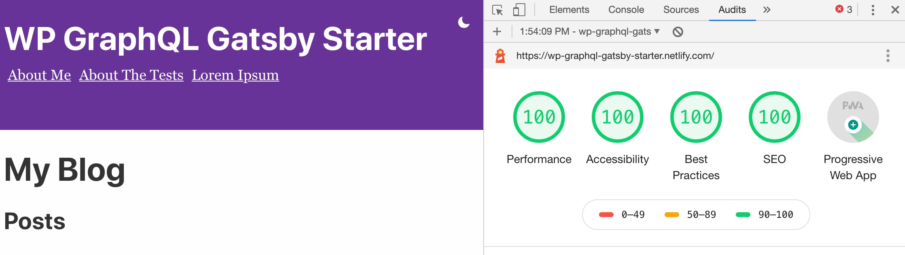

# WP GraphQL Gatsby Starter

> A super simple, bare-bone starter based on the Gatsby Starter for the front end and the WP GraphQL plugin on your WordPress install. 

This is a basic "headless CMS" setup. This starter will pull posts, pages, categories, tags, and a menu from your WordPress site. You should use either the TwentyNineteen or TwentyTwenty WordPress themes on your WordPress install. 

The example here uses the WordPress Theme Unit Test Data for post and page dummy content. 

**Find something wrong?** Issues are welcome on the starter reository. 

This Stater should get you started at 💯💯💯💯 across the board on Chrome Lighthouse Audits



## Get Started

I've tried to make this as simple and straightforward to get started. 

Here's the [DEMO](https://wp-graphql-gatsby-starter.netlify.com/).

The demo site here uses the good ol' [WordPress Theme Unit Test](https://codex.wordpress.org/Theme_Unit_Test) for demo posts.

If you've already got your WordPress site set up, or you are just looking to play around, here's what you need to do...

## 1. Setup on You WordPress Site and in the Starter

1. This starter should work with both the TwentyNineteen and TwentyTwenty themes.
2. You'll need to make sure that you have the Menu you want added to the `Social Menu` option in the `Apperance>>Menus>>Manage Locations` area of your WordPress Admin. It's labeled `Social Links Menu` in TwentyNineteen and `Social Menu` in Twenty Twenty.
3. You'll need to install the WP GraphQL plugin from Github (it's not on the WordPress.org plugin repository). You can get the latest version as a zip [here](https://github.com/wp-graphql/wp-graphql/archive/master.zip) which will allow you to upload it directly to your WordPress site, or clone it from the [respository](https://github.com/wp-graphql/wp-graphql).
4. I would also recommend installing the WPGraphiql plugin, which you can get from the Github repo [here](https://github.com/wp-graphql/wp-graphiql). This way you can play with the data.

## Clone and Configure Your Gatsby Starter

1. Clone this repo, `cd` into it, and then `npm install`.
2. Go to `gatsby-config.js` and modify this line to be your URL: `url: `https://your-wordpress-site.com/graphql`,` Make sure you keep the `/graphql` at the end!
3. If your menu is configured correctly, and you've copy-pasted your correct URL into the `gatsby-config.js` file, that should be all you need to do to set up.

## Running the Gatsby Site

1. In your termninal, run `gatsby develop`. You should see your site building successfully!
2. If you don't, and you get errors, make sure the WPGraphQL plugin is installed on your WordPress site and that it is activated. Also make sure that you have run `npm install` to get all the required packages. 

## Adjustments

If you need to edit ID or the depth of the menu, you can do so in the `src/components/menu.js` file:

```js
{
  wpgraphql {
    menuItems(where: {location: SOCIAL}) {
    edges {
        node {
        label
        url
        connectedObject {
            ... on WPGraphQL_Post {
            slug
            title
            }
            ... on WPGraphQL_MenuItem {
            title
            }
            ... on WPGraphQL_Tag {
            slug
            name
            }
            ... on WPGraphQL_Category {
            slug
            name
            }
            ... on WPGraphQL_Page {
            slug
            title
            }
        }
        childItems {
            edges {
            node {
                label
                url
                connectedObject {
                ... on WPGraphQL_Post {
                    slug
                    title
                }
                ... on WPGraphQL_MenuItem {
                    title
                }
                ... on WPGraphQL_Tag {
                    slug
                    name
                }
                ... on WPGraphQL_Category {
                    slug
                    name
                }
                ... on WPGraphQL_Page {
                    slug
                    title
                }
                }
            }
            }
        }
        }
    }
    }
  }
}
```

## Main List of Features

- ✅ posts queried and displayed
- ✅ pages queried and displayed
- ✅ categories and tags queried and displayed
- ✅ get the Primary menu (by slug: `primary`)
- ✅ implement light/dark mode, from [Using React Context API with Gatsby by Muhammad Muhsin](https://www.gatsbyjs.org/blog/2019-01-31-using-react-context-api-with-gatsby/)
- ✅ get all Lighthouse Audits to 💯as a starting point.

## ToDo List and Stretch Goals

- ___ Featured images done with Gatsby Image
- ___ Pagination for Posts, Pages, Categories, Tags
- ___ better menu handling for multiple menu levels and children-of-parent pages (e.g. About>>Our Team)
- ___ internal links are replaced with Gatsby `Link` (`gatsby-plugin-catch-links` doesn't seem to work?)

